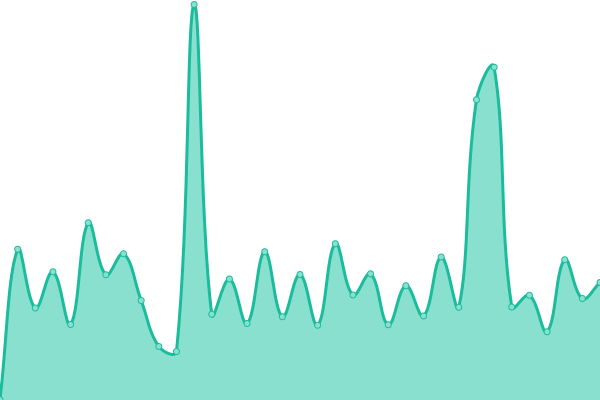

# [📈 Live Status](https://snapwiki.github.io/SnapWikiUptime): <!--live status--> **All systems are operational**

This repository contains the open-source uptime monitor and status page for the [Snap! Wiki](https://snapwiki.miraheze.org), powered by [Upptime](https://github.com/SnapWikiUptime/SnapWikiUptime).

With [Upptime](https://upptime.js.org), you can get your own unlimited and free uptime monitor and status page, powered entirely by a GitHub repository. We use [Issues](https://github.com/snapwiki/SnapWikiUptime/issues) as incident reports, [Actions](https://github.com/snapwiki/SnapWikiUptime/actions) as uptime monitors, and [Pages](https://snapwiki.github.io/SnapWikiUptime) for the status page.

<!--start: status pages-->
<!-- This summary is generated by Upptime (https://github.com/upptime/upptime) -->
<!-- Do not edit this manually, your changes will be overwritten -->
<!-- prettier-ignore -->
| URL | Status | History | Response Time | Uptime |
| --- | ------ | ------- | ------------- | ------ |
|  [Snap! Wiki](https://snapwiki.miraheze.org) | 🟩 Up | [snap-wiki.yml](https://github.com/snapwiki/SnapWikiUptime/commits/HEAD/history/snap-wiki.yml) | 

 566ms
     
 | 

<a href="https://snapwiki.github.io/SnapWikiUptime/history/snap-wiki">100.00%</a>
    

|  [Site](https://snapwiki.github.io) | 🟩 Up | [site.yml](https://github.com/snapwiki/SnapWikiUptime/commits/HEAD/history/site.yml) | 

 77ms
     
 | 

<a href="https://snapwiki.github.io/SnapWikiUptime/history/site">100.00%</a>
    

<!--end: status pages-->

[**Visit our status website →**](https://snapwiki.github.io/SnapWikiUptime)

## 📄 License

- Code: [MIT](./LICENSE) © [Upptime](https://Upptime.js.org)
- Data in the `./history` directory: [Open Database License](https://opendatacommons.org/licenses/odbl/1-0/)
